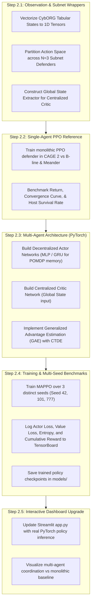

# Phase 2: Multi-Agent Deep Reinforcement Learning (MARL) Framework & Algorithm Selection Specification

**Course**: Soft Computing (B.Tech CSE, Netaji Subhas University of Technology - NSUT)  
**Academic Benchmark**: CybORG (CAGE Challenge 2 / 4)  
**Theoretical Foundation**: Nguyen & Reddi (IEEE TNNLS 2023), Yu et al. (MAPPO, NeurIPS 2022), Kiely et al. (CAGE 2/4)  

---

## 1. Formal Mathematical Formulation: Dec-POMDP / POSG

In modern enterprise cyber defense, no single security component has global visibility across all subnets, firewalls, and server clusters. Following **Nguyen & Reddi (IEEE TNNLS 2023)** and CAGE Challenge 2/4 specifications, we model the multi-agent defense system as a **Decentralized Partially Observable Markov Decision Process (Dec-POMDP)** formulated as a two-player zero-sum stochastic game between the Red Attacker team and the Blue Defender team:

$$\mathcal{M} = \langle \mathcal{N}, \mathcal{S}, \{\mathcal{A}_i\}_{i \in \mathcal{N}}, \mathcal{P}, \{r_i\}_{i \in \mathcal{N}}, \{\Omega_i\}_{i \in \mathcal{N}}, \{\mathcal{O}_i\}_{i \in \mathcal{N}}, \gamma \rangle$$

Where:
- $\mathcal{N} = \{1, 2, \dots, N\}$ is the set of $N$ Blue defender agents, where each agent $i$ is assigned to an autonomous administrative zone / subnet:
  - $\text{Agent}_1$: **User Workstation Subnet** (Host 0 to 4)
  - $\text{Agent}_2$: **Enterprise Server Subnet** (Enterprise Servers, Internal Services)
  - $\text{Agent}_3$: **Operational / Core Subnet** (Operational Hosts, Domain Controller)
- $\mathcal{S}$: True global state of the network (complete underlying host integrity, active malware processes, routing tables, and Red agent privilege levels). This state is **hidden** from Blue defenders.
- $\mathcal{A}_i$: Local discrete action space for Blue Agent $i$ (e.g., `Sleep`, `Analyse`, `Remove`, `Restore`, `DeployDecoy`).
- $\Omega_i$: Local observation space for Agent $i$. Blue agents only receive partial signals (IDS alerts, anomalous process flags, connection attempts) within their subnet.
- $\mathcal{O}_i(s) \rightarrow \Omega_i$: Observation emission probability distribution.
- $\mathcal{P}(s' \mid s, \mathbf{a})$: Environmental transition dynamics governed by CybORG, conditioned on the joint action $\mathbf{a} = (a_1, \dots, a_N, a_{\text{Red}})$.
- $r_i$: Local and team reward signals penalizing host compromise and service interruption while rewarding successful eradication.

---

## 2. Theoretical Analysis & Algorithm Selection

Based on the survey by **Nguyen & Reddi (IEEE TNNLS 2023, Table I & Section IV-F)**, we evaluate four candidate reinforcement learning paradigms for this multi-agent setting:

| Algorithm Class | Exemplar Algorithm | Advantages in Cyber Simulation | Failure Modes / Disadvantages in MARL | Decision |
|---|---|---|---|---|
| **Value-Based (Off-Policy)** | **Independent DQN / Double DQN** (Mnih et al. 2015, Hasselt et al. 2016) | High sample efficiency via Experience Replay Memory; simple discrete Q-value updates. | **Fails under non-stationarity**: Experience replay buffer becomes obsolete as co-agents update policies simultaneously; severe overestimation in stochastic games. | ❌ Rejected as primary MARL algorithm |
| **Factorized Value (CTDE)** | **QMIX / VDN** (Rashid et al. 2018) | Centralized action-value $Q_{\text{tot}}$ monotonic factorization. | Restricted by monotonic mixing assumption $\frac{\partial Q_{\text{tot}}}{\partial Q_i} \ge 0$; struggles when actions require sacrifice by one subnet to save the core Domain Controller. | ⚠️ Retained only as optional ablation |
| **Independent Policy Gradient** | **Independent PPO (IPPO)** (de Witt et al. 2020) | Decentralized computation; stable trust-region clipping; robust baseline. | **Non-stationary environment**: Treats peer agents as noise; high variance in multi-hop kill-chains. |  Used as initial Phase 2 baseline |
| **Centralized Actor-Critic (CTDE)** | **Multi-Agent PPO (MAPPO)** (Yu et al. 2022) | **Centralized Critic** $V_\phi(S)$ leverages true global state during training; **Decentralized Actors** $\pi_{\theta_i}(a_i \mid o_i)$ operate strictly on local partial observations; clipped surrogate objective prevents catastrophic policy collapse. | Requires dual-network architecture and centralized observation wrapper during training. |  **SELECTED: Core Phase 2 Algorithm** |

### Mathematical Formulation of MAPPO (Selected Method)

Each Blue defender $i$ is parameterized by a decentralized actor $\pi_{\theta_i}(a_i \mid o_i)$, while sharing or accessing a centralized value function $V_\phi(\mathbf{s})$ parameterized by $\phi$:

1. **Clipped Surrogate Objective for Actor $i$**:
$$L_{\text{CLIP}}(\theta_i) = \hat{\mathbb{E}}_t \left[ \min\left( \rho_{i,t}(\theta_i) \hat{A}_t, \, \text{clip}(\rho_{i,t}(\theta_i), 1-\epsilon, 1+\epsilon) \hat{A}_t \right) + \beta \mathcal{H}(\pi_{\theta_i}(\cdot \mid o_{i,t})) \right]$$
Where the probability ratio is:
$$\rho_{i,t}(\theta_i) = \frac{\pi_{\theta_i}(a_{i,t} \mid o_{i,t})}{\pi_{\theta_{i,\text{old}}}(a_{i,t} \mid o_{i,t})}$$
and $\mathcal{H}$ represents the entropy regularization term ensuring continuous exploration of defensive measures.

2. **Centralized Critic Value Loss**:
$$L_{\text{Value}}(\phi) = \hat{\mathbb{E}}_t \left[ \max\left( (V_\phi(\mathbf{s}_t) - R_t)^2, \, (V_{\phi,\text{old}}(\mathbf{s}_t) + \text{clip}(V_\phi(\mathbf{s}_t) - V_{\phi,\text{old}}(\mathbf{s}_t), -\epsilon_v, \epsilon_v) - R_t)^2 \right) \right]$$
Where $\mathbf{s}_t$ is the global state concatenation $\mathbf{s}_t = (o_{1,t}, o_{2,t}, \dots, o_{N,t}, s_{\text{global}})$, providing a stationary baseline for advantage estimation:
$$\hat{A}_t = \sum_{l=0}^{\infty} (\gamma \lambda)^l \delta_{t+l}^V, \quad \delta_t^V = r_t + \gamma V_\phi(\mathbf{s}_{t+1}) - V_\phi(\mathbf{s}_t)$$

---

## 3. Phase 2 Implementation Roadmap (Step-by-Step)

---

## 4. Work Breakdown Structure & Deliverables

1. **Deliverable 2.1** (`envs/wrappers.py`):
   - Multi-agent environment wrapper splitting CybORG into 3 localized action/observation spaces.
2. **Deliverable 2.2** (`agents/ppo_single.py` & `experiments/train_ppo.py`):
   - Single-agent baseline demonstrating policy improvement over rule-based heuristics.
3. **Deliverable 2.3** (`agents/mappo.py`):
   - Native PyTorch implementation of Decentralized Actors + Centralized Critic with GAE.
4. **Deliverable 2.4** (`experiments/train_marl.py`):
   - Multi-agent training pipeline recording metrics against B-line and Meander Red strategies.
5. **Deliverable 2.5** (`results/marl_benchmark.csv` & updated `app.py`):
   - Quantitative evaluation tables and live model weights playback for viva presentation.
