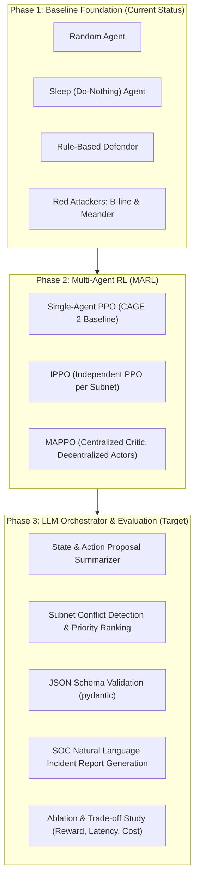

# Phase-Wise Project Roadmap & Architecture Specification
**Project Title**: LLM-Augmented Multi-Agent Reinforcement Learning for Automated Cyber Incident Response  
**Environment**: CybORG (CAGE Challenge 2 / Challenge 4)  
**Formulation**: Decentralized POMDP (Dec-POMDP) / POSG Zero-Sum Game  

---

## 1. Executive Summary & Progression Strategy

Our system decouples tactical high-speed defense (handled by RL agents inside the simulation) from strategic reasoning, priority scoring, conflict resolution, and SOC incident reporting (handled by an LLM orchestrator sitting above the RL agents).

---

## 2. Detailed Phase Specifications & Task Breakdown

### 📍 Phase 1: Baseline Environment & Heuristic Defenders (Current Phase)
* **Goal**: Establish the CybORG simulation setup, run deterministic and random baseline defenders against standardized Red attacker strategies, and record benchmark metrics.

#### Tasks & Action Items:
1. **Environment Initialization**: Instantiation of CybORG CAGE Challenge scenario.
2. **Baseline Agents Implementation (`agents/baselines.py`)**:
   - **Random Agent**: Samples actions uniformly from valid Blue action space.
   - **Sleep / Do-Nothing Agent**: Continuously executes `Sleep` (Action index 0) to compute lower bound return.
   - **Rule-Based Defender**: Applies predefined heuristics (e.g., restore compromised user/server hosts when anomalies are flagged).
3. **Red Attacker Baselines**:
   - **B-line Agent**: Aggressive, direct kill-chain path towards Enterprise Domain Controller.
   - **Meander Agent**: Exploratory, random-walk discovery across subnets.
4. **Benchmark Execution (`experiments/run_baselines.py`)**:
   - Run 100 episodes across multiple seeds.
   - Output mean & std return to `results/baselines.csv`.
5. **Phase 1 Interactive Demo**:
   - Streamlit Visual Playground displaying network state, active alerts, and step-by-step episode playback.

---

### 📍 Phase 2: Single-Agent PPO & Multi-Agent RL (MARL)
* **Goal**: Train reinforcement learning defenders capable of learning tactical defensive policies without manual rules.

#### Tasks & Action Items:
1. **Observation & Action Wrappers (`envs/wrappers.py`)**:
   - Vectorize tabular CybORG state into fixed-size 1D float arrays.
   - Partition action spaces by subnet (User Subnet, Enterprise Subnet, Operational Subnet).
2. **Single-Agent PPO Baseline (`agents/ppo_single.py`)**:
   - Train single PPO defender using `Stable-Baselines3` in CAGE Challenge 2.
   - Evaluate performance gain over Rule-Based baseline.
3. **Decentralized Multi-Agent RL (`agents/mappo.py`)**:
   - **Independent PPO (IPPO)**: Each subnet agent learns an independent policy from local observations.
   - **MAPPO (Multi-Agent PPO)**: Decentralized actor networks select local subnet actions; a Centralized Critic network receives global state during training.
4. **Reproducible Training Scripts (`experiments/train_marl.py`)**:
   - Multi-seed training (minimum 3 seeds).
   - Save policy weights and TensorBoard logs in `results/runs/`.

---

### 📍 Phase 3: LLM Orchestrator & System Evaluation (Final Target)
* **Goal**: Integrate an out-of-loop LLM orchestrator to guide multi-agent coordination, resolve action conflicts, and write human-readable SOC incident reports.

#### Tasks & Action Items:
1. **Strict JSON Schema Validator (`llm/schema.py`)**:
   - Enforce structured JSON output (`priority_scores`, `detected_conflicts`, `recommended_guidance`, `incident_report`).
   - Validate LLM output with `pydantic` to ensure safety (LLM text never directly controls network sockets).
2. **LLM Orchestrator Engine (`llm/orchestrator.py`)**:
   - Construct prompt templates (`llm/prompts.py`) feeding network state summary + proposed MARL actions to Gemini 2.5.
   - Implement response caching to keep development fast and cost-free.
3. **Ablation & Evaluation Framework (`experiments/evaluate.py`)**:
   - Compare 4 configurations:
     1. Rule-Based Defender
     2. Single PPO
     3. MAPPO Only
     4. MAPPO + LLM Orchestrator
   - Metrics recorded: Mean/Std Return, Host Compromise Rate, LLM Latency (ms), API Token Cost ($).
4. **Viva & Presentation Deliverables**:
   - Streamlit Interactive Playground (Live Demonstration).
   - Formatted course report & video demo backup.
